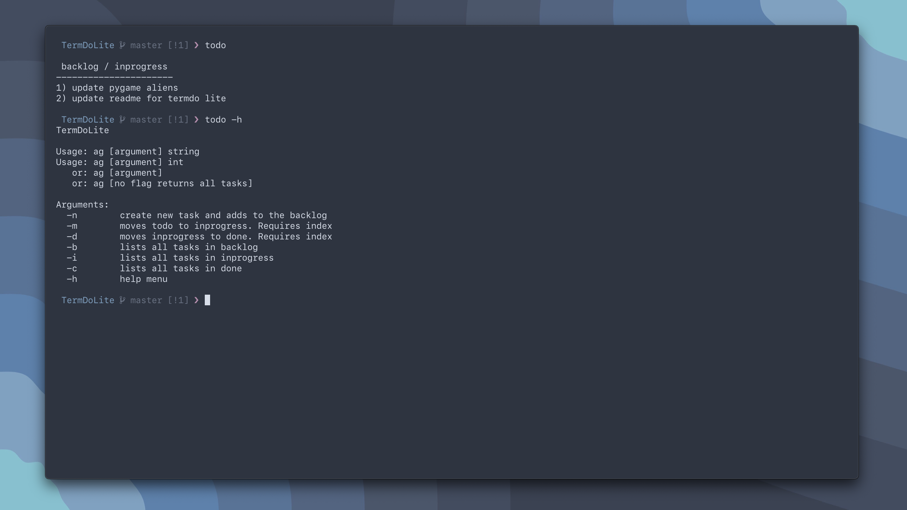

# TermDoLite

TermDoLite is intended to be a simple yet effective way to help increase 
productivity allowing you to use the cli rather than a .txt file for your 
todo lists

This project is a simple todo list application within the terminal,
the project was created using bash

## preview

